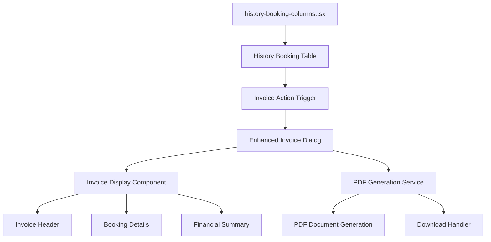
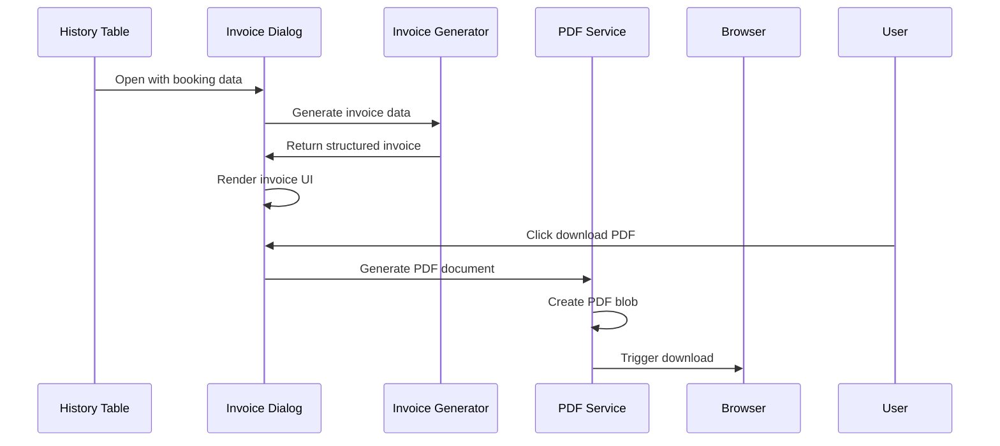

# Invoice Viewer Dialog Design

## Overview

This design document outlines the implementation of an enhanced Invoice Viewer Dialog component that displays booking invoices with PDF generation and download capabilities. The component will extend the existing `view-invoice-dialog.tsx` to provide a professional invoice layout with proper financial data presentation and PDF export functionality.

## Repository Type

This is a **Frontend Application** built with Next.js 15, React 19, and TypeScript, following modern React patterns with server and client components.

## Architecture

### Component Structure



### Data Flow Architecture



## Component Architecture

### Enhanced Invoice Dialog Component

#### Props Interface

```typescript
interface ViewInvoiceDialogProps {
  open: boolean;
  onOpenChange: (open: boolean) => void;
  booking: HistoryBooking | null;
}
```

#### State Management

```typescript
interface InvoiceDialogState {
  isGeneratingPDF: boolean;
  invoiceData: InvoiceData | null;
  error: string | null;
}
```

### Invoice Data Model

#### Extended Booking Interface

```typescript
interface InvoiceData {
  // Basic booking information
  bookingId: string;
  guestName: string;
  bookingDate: string;
  checkInDate: string;
  checkOutDate: string;

  // Hotel information
  hotelName: string;
  hotelAddress: string;
  roomType: string;
  numberOfNights: number;
  numberOfGuests: number;

  // Financial details
  basePrice: number;
  taxes: number;
  serviceFee: number;
  discount: number;
  totalAmount: number;
  currency: string;

  // Status information
  bookingStatus: "approved" | "waiting" | "rejected";
  paymentStatus: "paid" | "unpaid";

  // Invoice metadata
  invoiceNumber: string;
  invoiceDate: string;
  dueDate?: string;
  notes?: string;
}
```

### Invoice Generator Service

#### Mock Data Generator

```typescript
export class InvoiceGenerator {
  static generateFromBooking(booking: HistoryBooking): InvoiceData {
    // Generate comprehensive invoice data from basic booking
    return {
      ...booking,
      // Additional mock data for demonstration
      checkInDate: this.generateCheckInDate(),
      checkOutDate: this.generateCheckOutDate(),
      hotelName: this.generateHotelName(),
      hotelAddress: this.generateHotelAddress(),
      roomType: this.generateRoomType(),
      // Financial calculations
      basePrice: this.calculateBasePrice(),
      taxes: this.calculateTaxes(),
      serviceFee: this.calculateServiceFee(),
      discount: this.calculateDiscount(),
      totalAmount: this.calculateTotal(),
      // Metadata
      invoiceNumber: this.generateInvoiceNumber(),
      invoiceDate: new Date().toISOString(),
      currency: "IDR",
    };
  }
}
```

### PDF Generation Architecture

#### PDF Service Component

```typescript
export class PDFService {
  static async generateInvoicePDF(invoiceData: InvoiceData): Promise<Blob> {
    // Use @react-pdf/renderer to generate PDF document
    const doc = <InvoicePDFDocument invoice={invoiceData} />;
    return await pdf(doc).toBlob();
  }

  static downloadPDF(blob: Blob, filename: string): void {
    // Handle browser download
    const url = URL.createObjectURL(blob);
    const link = document.createElement('a');
    link.href = url;
    link.download = filename;
    document.body.appendChild(link);
    link.click();
    document.body.removeChild(link);
    URL.revokeObjectURL(url);
  }
}
```

#### PDF Document Template

```typescript
const InvoicePDFDocument: React.FC<{ invoice: InvoiceData }> = ({ invoice }) => (
  <Document>
    <Page size="A4" style={styles.page}>
      <View style={styles.header}>
        <Text style={styles.title}>INVOICE</Text>
        <Text style={styles.invoiceNumber}>#{invoice.invoiceNumber}</Text>
      </View>

      <View style={styles.section}>
        <Text style={styles.sectionTitle}>Booking Details</Text>
        <InvoiceDetailsSection invoice={invoice} />
      </View>

      <View style={styles.section}>
        <Text style={styles.sectionTitle}>Financial Summary</Text>
        <FinancialSummarySection invoice={invoice} />
      </View>
    </Page>
  </Document>
);
```

## UI Component Design

### Invoice Display Layout

#### Header Section

- Company branding area
- Invoice title and number
- Invoice date and due date
- Booking reference

#### Customer Information

- Guest name and contact details
- Booking ID reference
- Check-in/check-out dates

#### Service Details

- Hotel name and address
- Room type and occupancy
- Number of nights
- Service period

#### Financial Breakdown

- Itemized charges table
- Base price per night
- Taxes and fees breakdown
- Discount applications
- **Total amount** (prominent display)

#### Payment Information

- Payment status badge
- Payment method (if available)
- Due date for unpaid invoices

### Action Buttons

- **Download PDF** - Primary action button
- **Print** - Secondary action (optional)
- **Close** - Dialog close action

## Styling Strategy

### Tailwind CSS Classes

```css
.invoice-container {
  @apply mx-auto max-w-4xl bg-white p-8;
}

.invoice-header {
  @apply mb-6 border-b-2 border-gray-200 pb-6;
}

.invoice-title {
  @apply text-3xl font-bold text-gray-800;
}

.invoice-section {
  @apply mb-6 rounded-lg border border-gray-100 p-4;
}

.financial-table {
  @apply w-full border-collapse;
}

.total-row {
  @apply bg-gray-50 text-lg font-bold;
}
```

### PDF Styling

```typescript
const styles = StyleSheet.create({
  page: {
    flexDirection: "column",
    backgroundColor: "#FFFFFF",
    padding: 30,
  },
  header: {
    borderBottomWidth: 2,
    borderBottomColor: "#000000",
    paddingBottom: 20,
    marginBottom: 20,
  },
  title: {
    fontSize: 24,
    fontWeight: "bold",
    textAlign: "center",
  },
  section: {
    marginBottom: 20,
  },
  table: {
    display: "table",
    width: "auto",
    borderStyle: "solid",
    borderWidth: 1,
    borderRightWidth: 0,
    borderBottomWidth: 0,
  },
});
```

## API Integration Layer

### Mock Data Service

```typescript
export interface InvoiceApiService {
  async fetchInvoiceData(bookingId: string): Promise<InvoiceData> {
    // Mock implementation - replace with actual API call
    return InvoiceGenerator.generateFromBooking(mockBooking);
  }
}
```

### Future API Integration

```typescript
// Future implementation placeholder
export interface InvoiceApiService {
  async fetchInvoiceData(bookingId: string): Promise<InvoiceData>;
  async updateInvoiceStatus(invoiceId: string, status: string): Promise<void>;
  async generateInvoicePDF(invoiceId: string): Promise<Blob>;
}
```

## Error Handling & Loading States

### Loading States

- **Initial Loading**: Skeleton loader while generating invoice data
- **PDF Generation**: Loading spinner with "Generating PDF..." message
- **Download Progress**: Progress indicator for large PDF files

### Error Scenarios

```typescript
interface ErrorStates {
  INVOICE_GENERATION_FAILED: "Failed to generate invoice data";
  PDF_GENERATION_FAILED: "Failed to generate PDF document";
  DOWNLOAD_FAILED: "Failed to download PDF file";
  INVALID_BOOKING_DATA: "Invalid booking information provided";
}
```

### Error Handling Strategy

```typescript
const handlePDFGeneration = async (invoiceData: InvoiceData) => {
  try {
    setIsGeneratingPDF(true);
    const pdfBlob = await PDFService.generateInvoicePDF(invoiceData);
    const filename = `invoice-${invoiceData.invoiceNumber}.pdf`;
    PDFService.downloadPDF(pdfBlob, filename);
  } catch (error) {
    setError("Failed to generate PDF. Please try again.");
    console.error("PDF generation error:", error);
  } finally {
    setIsGeneratingPDF(false);
  }
};
```

## Accessibility & User Experience

### Keyboard Navigation

- Tab navigation through interactive elements
- Enter/Space key activation for buttons
- Escape key to close dialog

### Screen Reader Support

- Proper ARIA labels for all interactive elements
- Semantic HTML structure for invoice content
- Alternative text for visual elements

### Responsive Design

- Mobile-optimized invoice layout
- Scalable text and spacing
- Touch-friendly button sizes

## Testing Strategy

### Unit Testing

```typescript
describe("InvoiceViewerDialog", () => {
  test("renders invoice data correctly", () => {
    // Test invoice display
  });

  test("generates PDF successfully", async () => {
    // Test PDF generation
  });

  test("handles error states appropriately", () => {
    // Test error handling
  });
});
```

### Integration Testing

```typescript
describe("Invoice PDF Generation", () => {
  test("generates valid PDF from invoice data", async () => {
    // Test end-to-end PDF generation
  });

  test("downloads PDF with correct filename", () => {
    // Test download functionality
  });
});
```

## Implementation Roadmap

### Phase 1: Enhanced Dialog Component

1. Extend existing `ViewInvoiceDialog` with comprehensive invoice layout
2. Implement `InvoiceGenerator` service for mock data creation
3. Add professional styling and responsive design
4. Integrate with existing table action trigger

### Phase 2: PDF Generation

1. Implement PDF document template using `@react-pdf/renderer`
2. Create `PDFService` for PDF generation and download
3. Add loading states and error handling
4. Implement user feedback mechanisms

### Phase 3: API Integration

1. Replace mock data with actual API integration
2. Implement server-side invoice generation endpoint
3. Add invoice caching and optimization
4. Implement real-time invoice status updates

### Phase 4: Advanced Features

1. Multiple currency support
2. Custom invoice templates
3. Email integration for invoice delivery
4. Invoice history and archival system

## File Structure

````
components/
├── history-booking/
│   ├── dialog/
│   │   ├── view-invoice-dialog.tsx (enhanced)
│   │   └── invoice-pdf-document.tsx (new)
│   └── table/
│       └── history-booking-columns.tsx (existing)
├── ui/
│   └── loading-spinner.tsx (existing)
└── utils/
    ├── invoice-generator.ts (new)
    └── pdf-service.ts (new)

lib/
├── format.ts (existing - currency formatting)
└── invoice-utils.ts (new)

types/
└── invoice.ts (new)
```export class PDFService {
  static async generateInvoicePDF(invoiceData: InvoiceData): Promise<Blob> {
    // Use @react-pdf/renderer to generate PDF document
    const doc = <InvoicePDFDocument invoice={invoiceData} />;
    return await pdf(doc).toBlob();
  }

  static downloadPDF(blob: Blob, filename: string): void {
    // Handle browser download
    const url = URL.createObjectURL(blob);
    const link = document.createElement('a');
    link.href = url;
    link.download = filename;
    document.body.appendChild(link);
    link.click();
    document.body.removeChild(link);
    URL.revokeObjectURL(url);
  }
}
````

#### PDF Document Template

```typescript
const InvoicePDFDocument: React.FC<{ invoice: InvoiceData }> = ({ invoice }) => (
  <Document>
    <Page size="A4" style={styles.page}>
      <View style={styles.header}>
        <Text style={styles.title}>INVOICE</Text>
        <Text style={styles.invoiceNumber}>#{invoice.invoiceNumber}</Text>
      </View>

      <View style={styles.section}>
        <Text style={styles.sectionTitle}>Booking Details</Text>
        <InvoiceDetailsSection invoice={invoice} />
      </View>

      <View style={styles.section}>
        <Text style={styles.sectionTitle}>Financial Summary</Text>
        <FinancialSummarySection invoice={invoice} />
      </View>
    </Page>
  </Document>
);
```

## UI Component Design

### Invoice Display Layout

#### Header Section

- Company branding area
- Invoice title and number
- Invoice date and due date
- Booking reference

#### Customer Information

- Guest name and contact details
- Booking ID reference
- Check-in/check-out dates

#### Service Details

- Hotel name and address
- Room type and occupancy
- Number of nights
- Service period

#### Financial Breakdown

- Itemized charges table
- Base price per night
- Taxes and fees breakdown
- Discount applications
- **Total amount** (prominent display)

#### Payment Information

- Payment status badge
- Payment method (if available)
- Due date for unpaid invoices

### Action Buttons

- **Download PDF** - Primary action button
- **Print** - Secondary action (optional)
- **Close** - Dialog close action

## Styling Strategy

### Tailwind CSS Classes

```css
.invoice-container {
  @apply mx-auto max-w-4xl bg-white p-8;
}

.invoice-header {
  @apply mb-6 border-b-2 border-gray-200 pb-6;
}

.invoice-title {
  @apply text-3xl font-bold text-gray-800;
}

.invoice-section {
  @apply mb-6 rounded-lg border border-gray-100 p-4;
}

.financial-table {
  @apply w-full border-collapse;
}

.total-row {
  @apply bg-gray-50 text-lg font-bold;
}
```

### PDF Styling

```typescript
const styles = StyleSheet.create({
  page: {
    flexDirection: "column",
    backgroundColor: "#FFFFFF",
    padding: 30,
  },
  header: {
    borderBottomWidth: 2,
    borderBottomColor: "#000000",
    paddingBottom: 20,
    marginBottom: 20,
  },
  title: {
    fontSize: 24,
    fontWeight: "bold",
    textAlign: "center",
  },
  section: {
    marginBottom: 20,
  },
  table: {
    display: "table",
    width: "auto",
    borderStyle: "solid",
    borderWidth: 1,
    borderRightWidth: 0,
    borderBottomWidth: 0,
  },
});
```

## API Integration Layer

### Mock Data Service

```typescript
export interface InvoiceApiService {
  async fetchInvoiceData(bookingId: string): Promise<InvoiceData> {
    // Mock implementation - replace with actual API call
    return InvoiceGenerator.generateFromBooking(mockBooking);
  }
}
```

### Future API Integration

```typescript
// Future implementation placeholder
export interface InvoiceApiService {
  async fetchInvoiceData(bookingId: string): Promise<InvoiceData>;
  async updateInvoiceStatus(invoiceId: string, status: string): Promise<void>;
  async generateInvoicePDF(invoiceId: string): Promise<Blob>;
}
```

## Error Handling & Loading States

### Loading States

- **Initial Loading**: Skeleton loader while generating invoice data
- **PDF Generation**: Loading spinner with "Generating PDF..." message
- **Download Progress**: Progress indicator for large PDF files

### Error Scenarios

```typescript
interface ErrorStates {
  INVOICE_GENERATION_FAILED: "Failed to generate invoice data";
  PDF_GENERATION_FAILED: "Failed to generate PDF document";
  DOWNLOAD_FAILED: "Failed to download PDF file";
  INVALID_BOOKING_DATA: "Invalid booking information provided";
}
```

### Error Handling Strategy

```typescript
const handlePDFGeneration = async (invoiceData: InvoiceData) => {
  try {
    setIsGeneratingPDF(true);
    const pdfBlob = await PDFService.generateInvoicePDF(invoiceData);
    const filename = `invoice-${invoiceData.invoiceNumber}.pdf`;
    PDFService.downloadPDF(pdfBlob, filename);
  } catch (error) {
    setError("Failed to generate PDF. Please try again.");
    console.error("PDF generation error:", error);
  } finally {
    setIsGeneratingPDF(false);
  }
};
```

## Accessibility & User Experience

### Keyboard Navigation

- Tab navigation through interactive elements
- Enter/Space key activation for buttons
- Escape key to close dialog

### Screen Reader Support

- Proper ARIA labels for all interactive elements
- Semantic HTML structure for invoice content
- Alternative text for visual elements

### Responsive Design

- Mobile-optimized invoice layout
- Scalable text and spacing
- Touch-friendly button sizes

## Testing Strategy

### Unit Testing

```typescript
describe("InvoiceViewerDialog", () => {
  test("renders invoice data correctly", () => {
    // Test invoice display
  });

  test("generates PDF successfully", async () => {
    // Test PDF generation
  });

  test("handles error states appropriately", () => {
    // Test error handling
  });
});
```

### Integration Testing

```typescript
describe("Invoice PDF Generation", () => {
  test("generates valid PDF from invoice data", async () => {
    // Test end-to-end PDF generation
  });

  test("downloads PDF with correct filename", () => {
    // Test download functionality
  });
});
```

## Implementation Roadmap

### Phase 1: Enhanced Dialog Component

1. Extend existing `ViewInvoiceDialog` with comprehensive invoice layout
2. Implement `InvoiceGenerator` service for mock data creation
3. Add professional styling and responsive design
4. Integrate with existing table action trigger

### Phase 2: PDF Generation

1. Implement PDF document template using `@react-pdf/renderer`
2. Create `PDFService` for PDF generation and download
3. Add loading states and error handling
4. Implement user feedback mechanisms

### Phase 3: API Integration

1. Replace mock data with actual API integration
2. Implement server-side invoice generation endpoint
3. Add invoice caching and optimization
4. Implement real-time invoice status updates

### Phase 4: Advanced Features

1. Multiple currency support
2. Custom invoice templates
3. Email integration for invoice delivery
4. Invoice history and archival system

## File Structure

```
components/
├── history-booking/
│   ├── dialog/
│   │   ├── view-invoice-dialog.tsx (enhanced)
│   │   └── invoice-pdf-document.tsx (new)
│   └── table/
│       └── history-booking-columns.tsx (existing)
├── ui/
│   └── loading-spinner.tsx (existing)
└── utils/
    ├── invoice-generator.ts (new)
    └── pdf-service.ts (new)

lib/
├── format.ts (existing - currency formatting)
└── invoice-utils.ts (new)

types/
└── invoice.ts (new)
```
